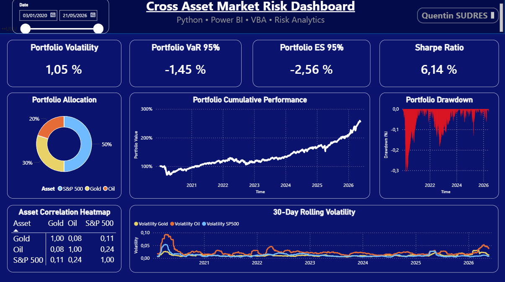

# Cross Asset Market Risk Dashboard

Interactive market risk dashboard combining:
- Python
- Power BI
- VBA
- Excel analytics

## Features

- Portfolio cumulative performance
- Portfolio drawdown analysis
- Rolling volatility
- VaR 95%
- Expected Shortfall 95%
- Correlation heatmap
- Dynamic date filtering

## Technologies Used

- Python (pandas, numpy)
- Power BI
- VBA
- Excel

## Dashboard Preview

## Author

Quentin Sudres
M2 Market Finance & Risk Management – Panthéon Sorbonne
